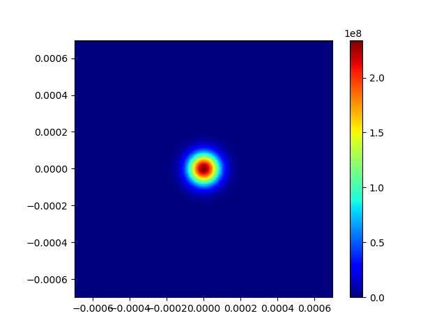

+++
title = "Running GPUE"
description = ""
weight = 1
alwaysopen = true
+++

{}

After building GPUE, it is important to run the unit tests with the `./gpue -u` command and make sure all tests pass.
If they do not, there could be a failure in the building process or a problem with running GPUE on the provided hardware.

After the unit tests have passed, you are free to use GPUE to your heart's content.
The easiest way to run GPUE is by using the provided help menu with the `./gpue -h` command and creating a command from that; however, a parameter file can also be used for this purpose if it is easier.

This section provides an introduction to the unit tests and a description of the help menu along with some example simulations to run.

## Unit tests
GPUE provides a suite of unit tests for the following operations:

1. *Math Operator Test:* A suite of tests for all in-built mathematical operators
2. *Double2 Functions Test:* A suite of tests for all in-built operators on CufftDoubleComplex or double2 types
3. *Grid Test:* This tests to ensures the gpu is functional and simply sends data back and forth to the GPU using a specified number of threads
4. *Parallel Summation Test:* this tests the parallel summation routine necessary for imaginary-time evolution
5. *FFT Test:* This is a simple test of the CUFFT library and makes sure that all plans used for FFT operations work
6. *Dynamic Test:* This is a test of all Abstract Syntax Tree (AST) functions necessary for dynamic fields and potentials.
7. *Bessel Test:* this is a test of the polynomial approximation to the bessel functions used in the AST data structure
8. *Make Complex Test:* A test of the `make_complex` function that turns potentials into operators for evolution
9. *cMultPhi_test:* Test of the `cMultPhi` kernel for evolution with an imprinted Phi parameter
10.**Evolution Test:* Test of imaginary and real0time evolution in 1, 2, and 3 dimensions. This first runs the simulation in imaginary time to ensure the appropriate energy for a single particle in the ground state of an *n*-dimensional harmonic oscillator and then runs the simulation in real-time to ensure the energy does not vary from this value.

These are all done with the `./gpue -u` command.
Please run this command after building GPUE to test your installation.

The most important of these tests is the Evolution Test.
This one ensures the physical accuracy of the results, so long as the appropriate energy is found in the ground state of the harmonic oscillator, the code should be working as-intended for simple evolution.
If any test fails, please create an issue on [GitHub](https://github.com/GPUE-group/GPUE)

## Help menu

To run GPUE, simply use the `./gpue` command with appropriate flags for the desired simulation.
To determine which flags should be used, please use the `./gpue -h` command, which will output the following:

```
                                      GPUE
          Graphics-Processing Unit Gross--Piteavskii Equation solver
Options:

-A rotation     Set gauge field mode [beta]
-a              Set flag to graph [deprecated]
-b 2.5e-5       Set box size (xyzMax in 3d)
-C 0            Set device (Card) for GPU computing
-c 2            Set coords (1, 2, 3 dimensions)
-D 0.0          Set's offset for kill (-K flag) distance radially
-d data         Set data directory - where to store / read data (here in data/)
-E              Perform energy calculation every writing step
-e 1            Set esteps, number of real-time evolution steps
-f              Unset write to file flag
-G 1            Set GammaY, ratio of omega_y to omega_x
-g 1            Set gsteps, number of imaginary-time evolution steps
-H phrase       Print help menu, searching for "phrase"
-h              Print help menu, exit GPUE
-I "param.cfg"  Set Input parameter file
-i 1            Set interaction strength between particles
-j 1            Set threshold multiplier for easier vortex detection 
-J              Set cylindrical coordinate output for B-field (no letters)
-K 0            Selects vortex with specified ID to be 
                    killed/flipped/mutliply-charged
-k 0            Set kick_it, kicking for Moire lattice simulations
                    0 = off, 1 = periodic kicking, 2 = single kick
-L 0            Set l, vortex winding [2*pi*L]
-l              Set ang_mom flag to use angular momentum
-m              Set 2d_mask for vortex tracking
-n 1            Set N, number of particles in simulation
-O 0            Set angle_sweep, kicking potential rotation angle
-P 0            Set laser_power, strength of kicking [hbar * omega_perp]
-p 100          Set printSteps, frequency of printing
-Q 0            Set z0_shift, z shift of kicking potential (bad flag, I know)
-q 0            Set the vortex winding for imprinting/annihilation/flipping 
                    during real-time. The value is the charge of the new vortex
-R 1            Set ramping flag for imaginary time evolution
                    1 for ramping up, 0 for ramping down
-r              Set read_wfc to read wavefunction from file
-S 0            Set sepMinEpsilon, kicking potential lattice spacing scaling
-s              Set gpe, flag for using Gross-Pitaevskii Equation
-T 1e-4         Set gdt, timestep for imaginary-time
-t 1e-4         Set dt, timestep for real-time
-U 0            Set x0_shift, x shift of kicking potential, shift of the 
                    imprinting vortex position defined by K and q
-u              Performs all unit tests
-V 0            Set y0_shift, y shift of kicking potential, shift of the 
                    imprinting vortex position defined by K and q
-v              Set potential [beta]
-W              Set write_it, flag to write to file
-w 0            Set Omega_z, rotation rate relative to omega_perp
                    This acts as a value to multiply the gauge fields by
-X 6.283        Set omega_x
-x 256          Set xDim, dimension in X (power of 2, please!)
-Y 6.283        Set omega_y
-y 256          Set yDim, dimension in Y (power of 2, please!)
-Z 6.283        Set omega_z, confinement in z-dimension
-z 256          Set zDim, dimension in Z (power of 2, please!)


Notes:

- Parameters specified above represent the default values for the classic 
  linear Schrodinger equation and may need to be modified to match your
  specific problem.

- We use real units with an Rb87 condensate

- You may generate a simple vortex lattice in 2d with the following command:
  ./gpue -x 512 -y 512 -g 50000 -e 1 -p 5000 -W -w 0.5 -n 1e5 -s -l -Z 10

- Thanks for using GPUE!
```

If you would like to search this for a particular flag, please use the `./gpue -H search_variable` command.
For example, if I wanted to change `omega_x` I might search for it like so:

```
./gpue -H omega
```

which will provide the following:

```
-G 1            Set GammaY, ratio of omega_y to omega_x
-P 0            Set laser_power, strength of kicking [hbar * omega_perp]
-w 0            Set Omega_z, rotation rate relative to omega_perp
-X 6.283        Set omega_x
-Y 6.283        Set omega_y
-Z 6.283        Set omega_z, confinement in z-dimension
```

This will make it easier to find the flags you might want for the simulation.

## Special considerations

There are several flags that need special consideration here:

1. `-r`: This flag will read in a wavefunction from file and will naturally look for it in the `data/wfc_load` and `data_wfci_load` files.
If these files do not exist, GPUE will ask for appropriate filenames.
If the file lengths do not match the dimensions of the simulation, it will ask for new filenames again.
2. `-A`: This flag will read in a gauge field, which can be `rotation`, `constant`, `test`, or `file`.
If the gauge field is being read in from a file, it will look for the field in the `data/Axgauge`, `data/Aygauge`, and `data/Azgauge` files.
If they do not exist or are of the wrong dimensions, GPUE will prompt for a new file.
3. `-v`: This flag is naturally set to be a harmonic oscillator, but can use the `torus` option in 3D.
Otherwise, the flag's default will be `harmonic`
4. `-I`: This flag will read in a configuration file for dynamic fields, which will be described later in the documentation
5. `-d`: This flag will specify a data directory.
All configuration files are expected to be in this directory.
If the directory does not exist at the start of the simulation, GPUE will create the directory.

## Example simulation

In addition to the `./gpue -u` command, the help menu recommends running the following command:

```
./gpue -x 512 -y 512 -g 50000 -e 1 -p 5000 -W -w 0.6 -n 1e5 -s -l -Z 100
```

Here, we will run a slightly modified version of this:

```
./gpue -x 512 -y 512 -g 50001 -e 1 -p 5000 -W -w 0.6 -n 1e5 -s -l -Z 100 -d data_2d_example
```

This will simulate a BEC in imaginary time influenced by a typical angular momentum field and will provide several quantized vortices.
Here are the parameters of this simulation:

* `-x 512 -y 512`: 512x512 resolution
* `-g 50001`: 50001 imaginary time steps. Note that we start counting at 0, so adding the 1 guarantees evolving through the 50000th step
* `-e 1`: 1 real time step.
* `-p 5000`: printing to terminal every 5000 steps
* `-W`: writing to file when printing to terminal
* `-w 0.6`: rotational omega value of 0.6 (1 is the maximum)
* `-n 1e5`: 100000 atoms
* `-s`: using nonlinear Schr&ouml;dinger equation
* `-l`: turning on angular momentum (gauge fields)
* `-Z 100`: strongly confined in the Z direction with a trapping frequency of 100
* `-d data_2d_example`: outputting data into the `data_2d_example` directory

If more ground state evolution timesteps were requested by increasing the value after the `-g` flag, a triangular vortex lattice can be generated.

The data can be plotted with the `plot.py` file in the `py/` directory with the following command:

```
python plot.py i wfc r 0 50000 5000 d data_2d_example
```

Here, we are plotting the wavefunction (`i wfc`) from 0 to 50,000 in steps of 5000 (`r 0 50000 5000`) in the `data_2d_example` directory (`d data_2d_example`).

This will provide a series of images that should look something like this:


